# tugaspertemuan7

## latihan pertama
memasukan kode input a dan b lalu masukan juga kode maks nya 

print a dan b lalu masukan kode if dan else seperti digambar ini 

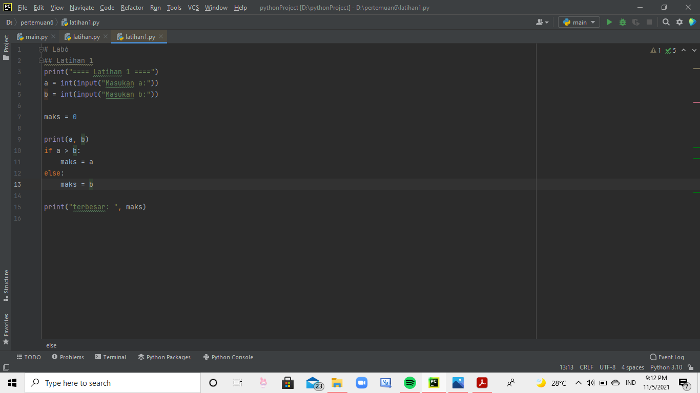
lalu ketik print terbesarnya 

kemudian di run. dan hasilnya akan jadi seperti ini 

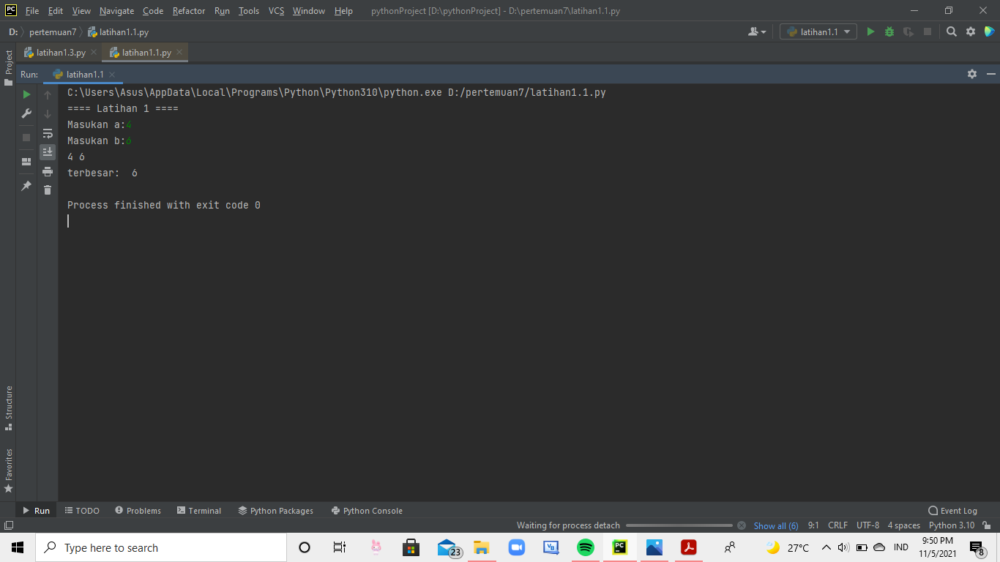

## latihan kedua
masukan kode seperti ini lalu di print dan kemudian di run 

hasilnya akan seperti jadi ini 

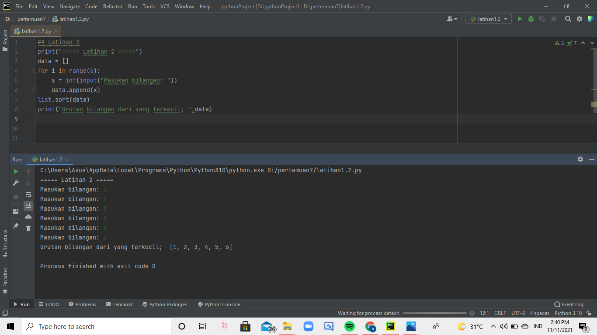

## latihan ketiga 
masukkan list angkanya, lalu masukan kode for dan in lalu ketik print dan end. 

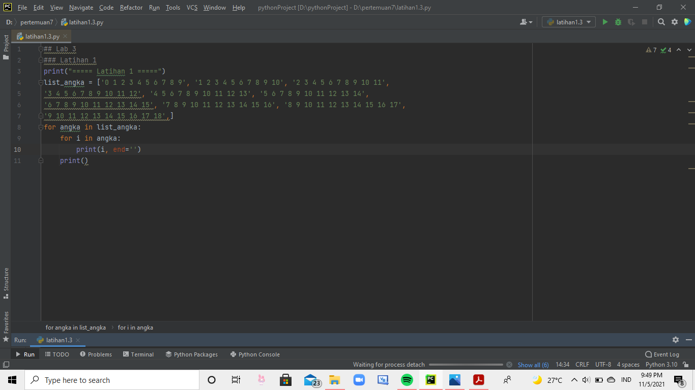
kalau sudah, klik run dan hasilnya akan menjadi seperti ini 

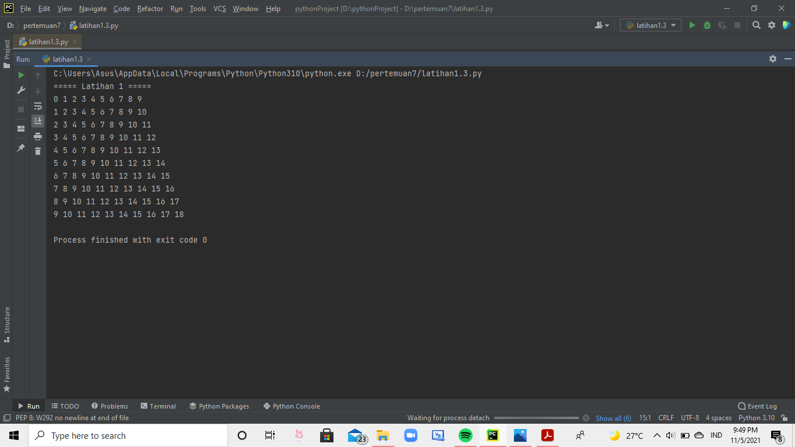

## latihan keempat 
ketik import lalu masukan while dan if lalu di print 

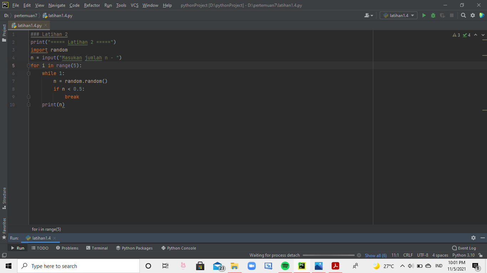
lalu hasilmya jadi seperti ini 

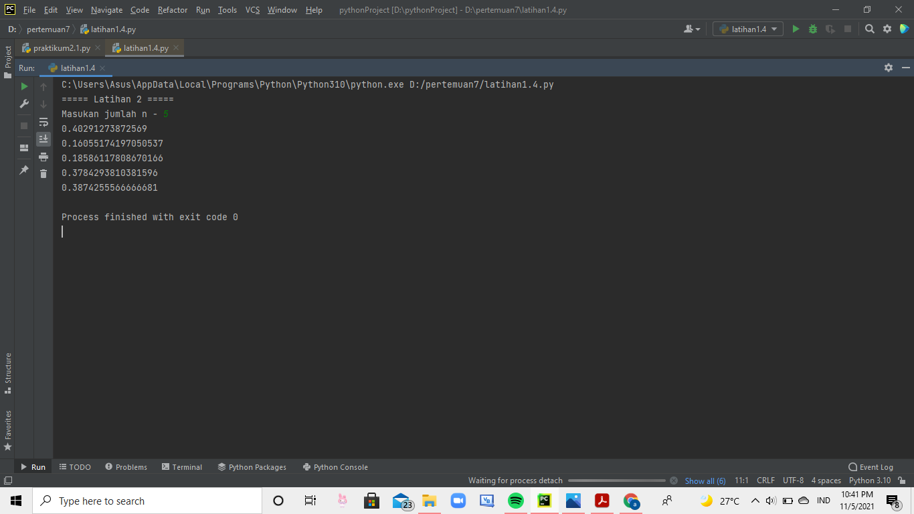

## latihan kelima 
ketik masukan input lalu ketik kode if dan else 

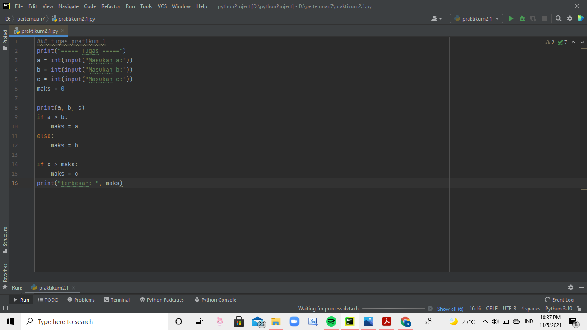
lalu di run dan hasilnya seperti ini 

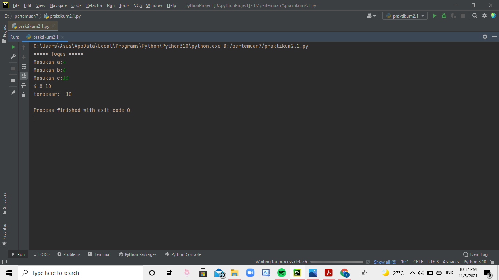

## latihan keenam 
ketik import lalu input, masukan kode while dan if, lalu ketik break, dan print 

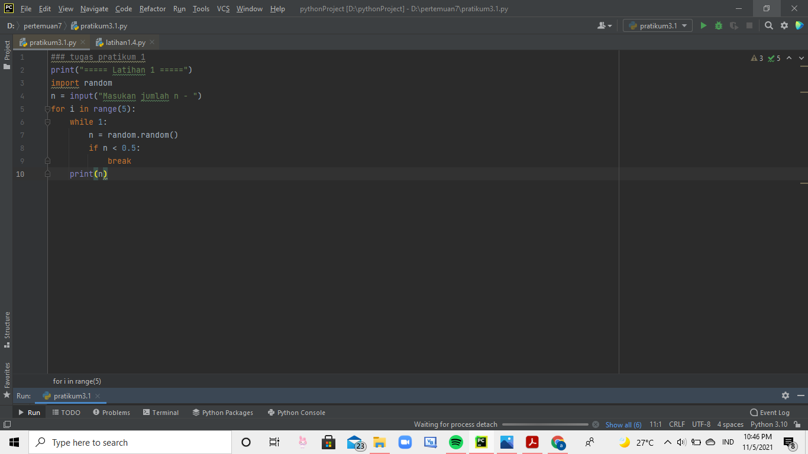
dan di run 

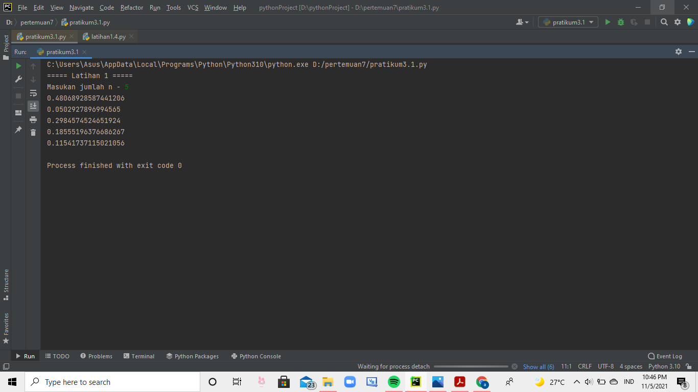

## latihan ketujuh 
masukan input, ketik kode if dan else. print terbesarnya, lalu ketik for i in range dan print terbesarnya. 

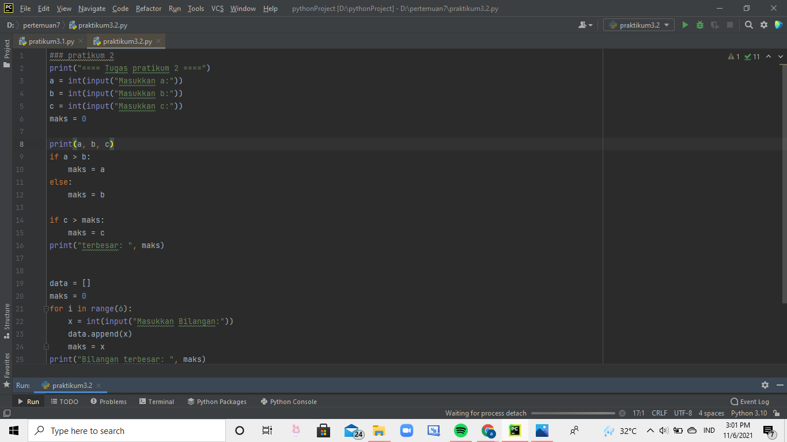
dan di run 

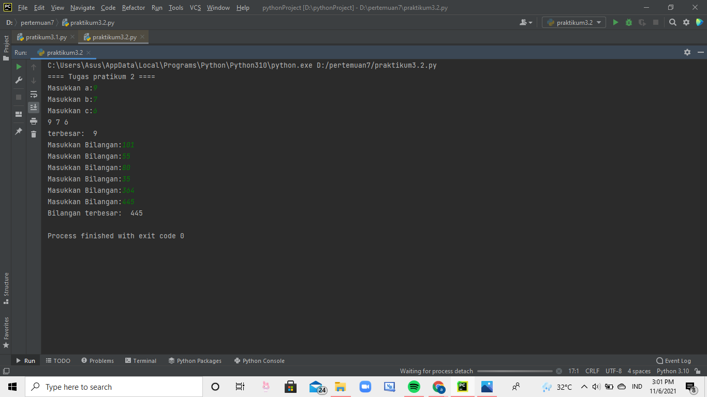

## latihan kedelapan 
masukan input dan bilangan modalnya 

lalu ketik for i in range 

lalu di print, dan di run 

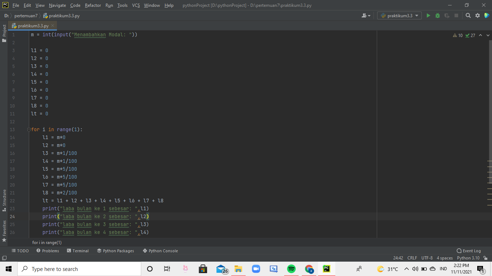
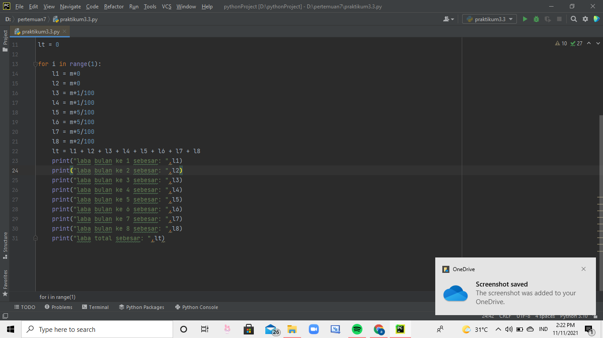
hasilnya jadi seperti ini 

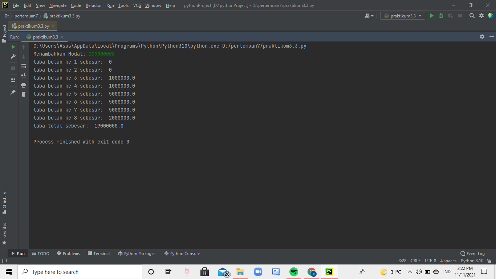
